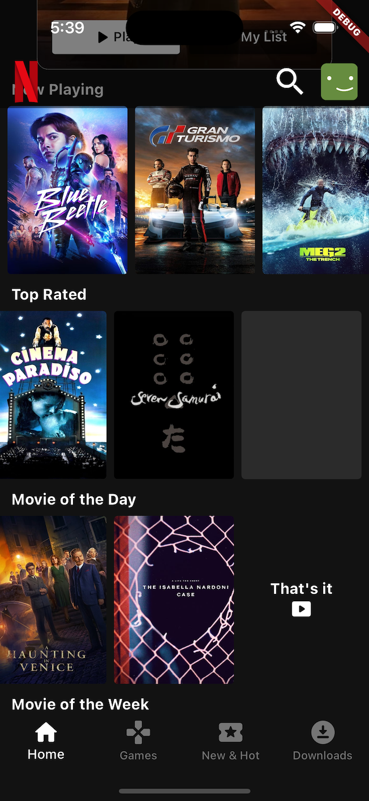
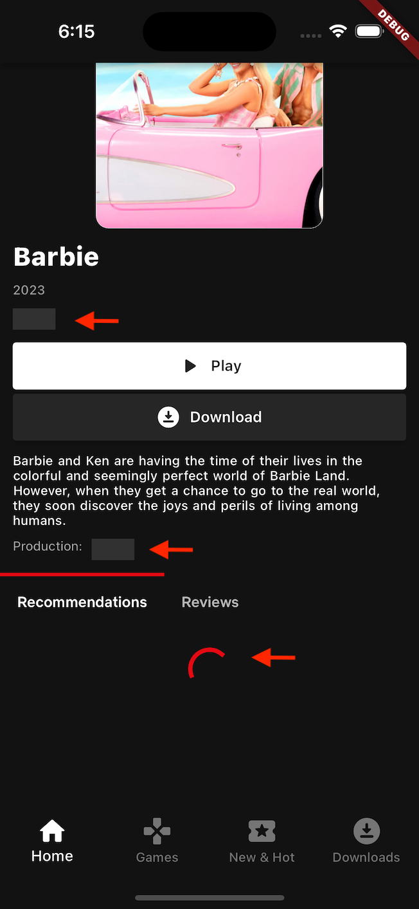
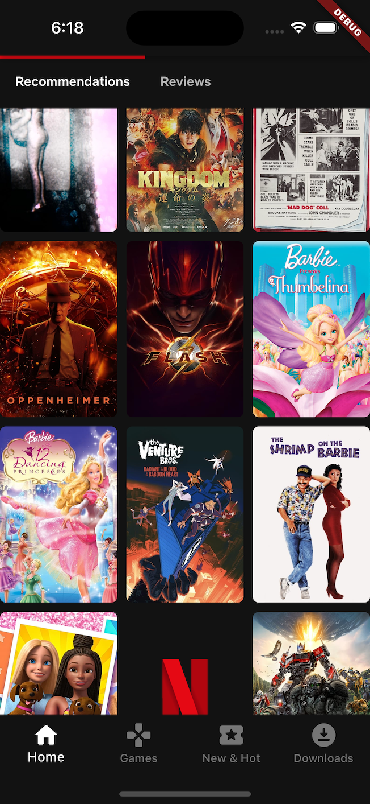
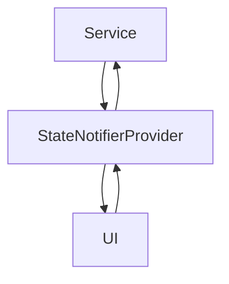

# TMDB with Riverpod Flutter

This application is to demonstrate how to use Riverpod to manage the state of the application.

## Project Overview

The primary focus of this project is to demonstrate the structure of a Flutter app that interacts with the TMDB API to create a Netflix-like interface. While not an exact replica of Netflix, it showcases the following key features:

1. **Home Screen**: The landing screen of the app, designed to resemble a Netflix-style homepage. It contains horizontal list view widgets displaying various movie categories.

2. **Details Screen**: When a user taps on an item from the list view on the home screen, they are navigated to a details screen. This screen provides additional information about the selected movie.

> [!NOTE]
> The images, SVG, and TrueType fonts used in this project are for demonstration purposes only and are not licensed. If you are the owner of any of these assets and are uncomfortable with their usage, please feel free to contact me, and I will promptly remove them.

## Project Structure
The project follows a feature-based or screen-based organization, where each feature or screen has its dedicated structure, including folders for controller, interface, services, widgets, and models (if necessary). This modular approach enhances code maintainability and allows for clear separation of concerns.

- `lib/screens/`: This directory now includes `base_screen.dart`, which serves as the foundation for screens with common elements like the bottom navigation bar.
- `lib/controller/`: This directory consists of a generic StateNotifier that can be reused for most scenarios. It includes `PageState`, which is used for loading list views with pagination, and `LoadState`, which is used for loading data from API calls.
- `lib/models/`:This directory contains data models that are shared throughout the app, such as ApiResponse and standard result structures. Additionally, it can accommodate business models that are used across the entire application.
- `lib/providers/`: Within this directory, you'll find global providers that offer instances needed for the application, instances that only need to be created once. For instance, it includes the Dio instance or database instance. 
- `lib/widgets/`: This directory can be used to store commonly used widgets such as customized dialogs, buttons, form fields, etc., that are reusable throughout the application.

- `lib/movie_details/`:  This directory represents a specific feature or screen in the app, specifically the movie_details screen.
- `lib/movie_details/controller`: This directory is dedicated to handling use-cases and control logic related to movie details. Typically, it contains a StateNotifier provider responsible for making API calls, processing data, and providing the resulting state to the user interface.
- `lib/movie_details/interface`: This directory consists of an abstract class that provides the functions that need to be implemented in the service layer for movie details.
- `lib/movie_details/services`: Service layer to call API for movie details screen
- `lib/movie_details/widgets`: Customize widgets that will only be used in movie details screen

## UI & State Explanation

| File                                                                            | Screens                                                                                               | Explanation                                                                                                                                                                                                                                                                                                                                                                                                                                                                                                                                                                                                                                                                                                                                                                                                                                                                                                                                                                                                                                                                                                                                                                                                                                                                                                                                                                                                                                                                  |
|---------------------------------------------------------------------------------|-------------------------------------------------------------------------------------------------------|------------------------------------------------------------------------------------------------------------------------------------------------------------------------------------------------------------------------------------------------------------------------------------------------------------------------------------------------------------------------------------------------------------------------------------------------------------------------------------------------------------------------------------------------------------------------------------------------------------------------------------------------------------------------------------------------------------------------------------------------------------------------------------------------------------------------------------------------------------------------------------------------------------------------------------------------------------------------------------------------------------------------------------------------------------------------------------------------------------------------------------------------------------------------------------------------------------------------------------------------------------------------------------------------------------------------------------------------------------------------------------------------------------------------------------------------------------------------------|
| [lib/home/home_screen.dart](lib/home/home_screen.dart)                          |                                                            | A StateNotifier called `PageState` is created to manage the state of loading a list view/grid view. Each state will display its respective widgets.  `PageState` consists of 5 states, including: -`Loading`:This state initializes the first API call to fetch the items. For example, it displays a Circular Indicator. -`Data`:  After the API call has been completed, data is ready to be loaded into the UI. For example, it displays a ListView/GridView. -`Error`: This state indicates an error occurred during the first API call. For example, it displays an error message. -`OnSubsequentLoad`: This state represents loading subsequent data. For example, it displays a Circular Indicator at the last item in the list. -`OnSubsequentError`: This state indicates an error occurred during subsequent API calls. For example, it displays an error message at the last item in the list.  **Now Playing** section is in the "`Data` state **Top Rated** section is in the `OnSubsequentLoad` state  **Movie of the Day** section is in the `Data` state, indicating that it has reached the end of the page.   [Refer to lib/controller/page_state_notifier.dart for more details](https://github.com/Brysenp/tmdb_app/blob/develop/lib/controller/page_state_notifier.dart)                                                                                                                            |
| [lib/home/movie_detail_screen.dart](lib/movie_details/movie_detail_screen.dart) |   | A StateNotifier called `LoadState` is created to manage the state of loading data / calling API. Each state will display its respective widgets.  `LoadState` consists of 3 states, including: -`Loading`:This state initializes the first API call to fetch the items. For example, it displays a Circular Indicator. -`Data`:  After the API call has been completed, data is ready to be loaded into the UI. For example, it displays a Text or perform navigating action. -`Error`: This state indicates an error occurred during the API call. For example, it displays an error message or prompting a alert dialog.  **Production** section is in the "`Loading` state where it's still waiting the API to fetch the data due to slow network **Recommendation** section is in the `Loading` state but since it is a grid view so we are using a `PageState` that we have discussed earlier instead of `LoadState`   [Refer to movie_details_state_notifier.dart for more details](https://github.com/Brysenp/tmdb_app/blob/develop/lib/movie_details/controller/movie_detail_state_notifier.dart)  With the help of Riverpod we are able to rebuilt the widgets that are neccessary instead of refeshing the whole screen. In this case, when the GridView is fetching the new data, only the grid view will be rebuilt but not the list view in the **Review** section or the **Movie Details** on top section |

Here is a data flow:

The Service Layer will call the API and fetch the data to StateNotifierProvider, then the StateNotifierProvider will further proccess the data and manage the state of the widgets/screen. Finally the StateNotifierProvider will notify the respective widget based on the state to render the widget.

In reverse, when the user perform an action such as tap on a button, the UI can change the state of the StateNotifierProvider and call the function or API for the next action.

## Demo

## Next Steps
-[x] Implement **Dio with Interceptor** :tada:
-[x] Implement **StateNotifier** :tada:
-[x] Implement **Paginating** :tada:
-[x] Implement **Complex UI** (Nested List without rebuilding other widgets when paginating) :tada:
-[ ] **Unit Test** 
-[ ] **UI Test** 